# Manual Técnico y Operativo: POS Estacionamiento (Parkeate)

Este documento detalla el funcionamiento, la interfaz y las acciones disponibles para las primeras 5 pantallas de la aplicación POS (Point of Sale) del sistema de estacionamiento **Parkeate** de **Deepcompany**.

---

## Índice

1. [Pantalla 01: Registro de Aplicación](#pantalla-01-registro-de-aplicación)
2. [Pantalla 02: Inicio de Sesión (Login)](#pantalla-02-inicio-de-sesión-login)
3. [Pantalla 03: Menú Lateral del Login](#pantalla-03-menú-lateral-del-login)
4. [Pantalla 04: Lista de Usuarios POS](#pantalla-04-lista-de-usuarios-pos)
5. [Pantalla 05: Pantalla Principal del POS](#pantalla-05-pantalla-principal-del-pos)
6. [Pantalla 06: Acceso / Permiso de Supervisor](#pantalla-06-acceso--permiso-de-supervisor)
7. [Pantallas 07 y 08: Menú Lateral de la Pantalla Principal](#pantallas-07-y-08-menú-lateral-de-la-pantalla-principal)
8. [Pantalla 09: Buscar Cliente (Facturación Personalizada)](#pantalla-09-buscar-cliente-facturación-personalizada)
9. [Pantalla 10: Registrar Cliente Nuevo](#pantalla-10-registrar-cliente-nuevo)
10. [Pantalla 11: Cambiar Tarifa (Boleto Físico)](#pantalla-11-cambiar-tarifa-boleto-físico)
11. [Pantalla 12: Emisión de Ticket Perdido](#pantalla-12-emisión-de-ticket-perdido)
12. [Pantallas 13 y 14: Buscar y Verificar Paquetes (Usuarios Frecuentes y Locatarios)](#pantallas-13-y-14-buscar-y-verificar-paquetes-usuarios-frecuentes-y-locatarios)
13. [Pantalla 15: Generar Ticket de Caja](#pantalla-15-generar-ticket-de-caja)
14. [Pantallas 16 y 17: Buscar Ticket (Ingreso Manual)](#pantallas-16-y-17-buscar-ticket-ingreso-manual)
15. [Pantallas 18 y 19: Buscar Facturas (Reimpresión y Consulta)](#pantallas-18-y-19-buscar-facturas-reimpresión-y-consulta)
16. [Pantallas 20 a 23: Registro de Pago y Facturación Multimétodo](#pantallas-20-a-23-registro-de-pago-y-facturación-multimétodo)
17. [Pantalla 24: Nota de Crédito (Anulaciones)](#pantalla-24-nota-de-crédito-anulaciones)
18. [Pantallas 25 y 26: Pre-cierre de Caja (Corte y Cambio de Turno)](#pantallas-25-y-26-pre-cierre-de-caja-corte-y-cambio-de-turno)
19. [Pantalla 27: Cierre de Caja (Cierre de Caja y Reporte Z)](#pantalla-27-cierre-de-caja-cierre-de-caja-y-reporte-z)

---

## Pantalla 01: Registro de Aplicación

Esta pantalla inicial permite configurar y enlazar la terminal física (POS, computadora) con el servidor del estacionamiento local (PLS - Parking Lot Server). Es un paso exclusivamente técnico que se realiza antes de iniciar operaciones.

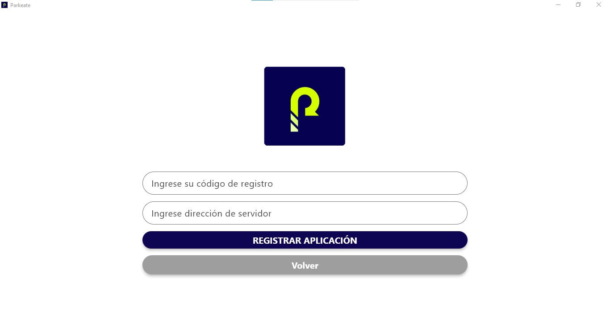

### Componentes y Campos de Entrada

* **Logo "P" de Parkeate:** Identificador visual de la marca en color verde lima sobre un recuadro azul marino.
* **Campo "Ingrese su código de registro":** Campo de texto donde el técnico introduce el código identificador de la terminal asignada en el sistema (ej. `7f10dc`).
* **Campo "Ingrese dirección de servidor":** Dirección IP y puerto del servidor local (PLS) al cual se conectará el POS (ej. `http://4.153.231.212:3000`).

### Botones y Acciones

* **REGISTRAR APLICACIÓN (Botón Azul Profundo):** Valida los datos ingresados y realiza la petición de emparejamiento. Si es exitosa, guarda la configuración en la base de datos local y habilita la pantalla de Login.
* **Volver (Botón Gris):** Cancela el proceso y regresa a la pantalla previa. Solo se muestra si la aplicación ya está registrada, no en la pantalla de registro inicial.

---

## Pantalla 02: Inicio de Sesión (Login)

Una vez que la aplicación está registrada en el servidor, los usuarios (cajeros y administradores) pueden acceder ingresando sus credenciales autorizadas desde el Backoffice.

### Componentes y Campos de Entrada

* **Cabecera Azul Marino:** Barra superior de la aplicación que contiene el ícono del menú de hamburguesa en el extremo izquierdo.
* **Campo "Usuario":** Campo de texto para ingresar el nombre de usuario asignado.
* **Campo "Contraseña":** Campo de entrada oculto por defecto con un ícono de ojo a la derecha para alternar la visibilidad de los caracteres.

### Botones y Acciones

* **INICIAR SESIÓN (Botón Azul Profundo):** Envía las credenciales al servidor para su validación. Al autenticar con éxito, abre la pantalla principal de cobro.
* **Panel Desplazable Inferior (Sesiones):** Permite vislumbrar información rápida sobre las sesiones activas en el dispositivo.

---

## Pantalla 03: Menú Lateral del Login (Hamburguesa)

Accesible desde la pantalla de login haciendo clic en las tres líneas horizontales (hamburguesa) del extremo superior izquierdo. Este panel contiene herramientas administrativas y de diagnóstico de hardware específicas antes de iniciar sesión.

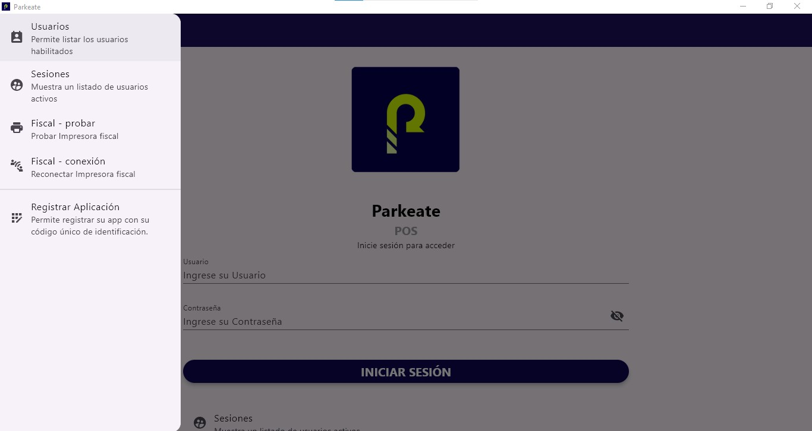

### Herramientas y Opciones Disponibles

1. **Usuarios:** "Permite listar los usuarios habilitados". Abre la pantalla de consulta de cajeros autorizados cargados en el POS local.
2. **Sesiones:** "Muestra un listado de usuarios activos". Permite monitorear quiénes tienen una sesión abierta o en ejecución.
3. **Fiscal - probar:** "Probar Impresora fiscal". Ejecuta un comando de prueba en la impresora fiscal conectada a la computadora para verificar que esté en línea y lista para imprimir facturas y reportes.
4. **Fiscal - conexión:** "Reconectar Impresora fiscal". Intenta restablecer el canal de comunicación (puerto serial/USB) entre la computadora y la impresora fiscal en caso de desconexión.
5. **Registrar Aplicación:** "Permite registrar su app con su código único de identificación". Redirecciona al técnico a la **Pantalla 01** para cambiar el servidor o reconfigurar la terminal.

---

## Pantalla 04: Lista de Usuarios POS

Pantalla de consulta que muestra las fichas de los cajeros y personal administrativo registrados localmente en el dispositivo.

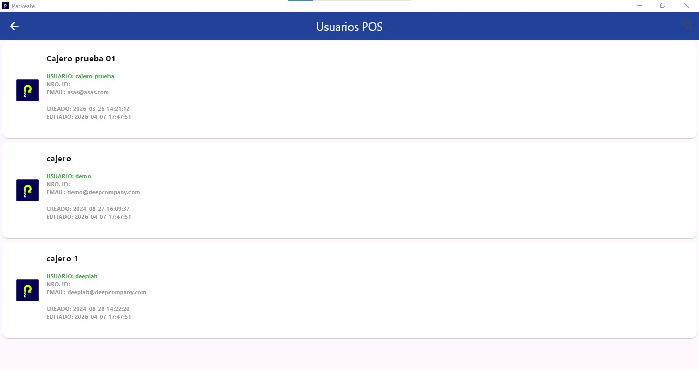

### Componentes de la Interfaz

* **Barra de Título Azul:**
  * Botón de flecha de retorno (`<-`) a la izquierda para volver al Login/Menú.
  * Título centrado "Usuarios POS".
  * Botón de búsqueda (Lupa) a la derecha para buscar usuarios por nombre o ID.
* **Fichas de Usuario (Tarjetas Blancas):** Cada tarjeta contiene:
  * **Nombre Completo del Cajero:** (Ej. "Cajero prueba 01", "cajero", "cajero 1").
  * **Usuario (Username en verde):** Identificador corto utilizado para el login (Ej. `cajero_prueba`, `demo`, `deeplab`).
  * **Nro. ID:** Identificador numérico del empleado.
  * **Fecha de Creación y Edición:** Tiempos de registro e histórico de cambios.

---

## Pantalla 05: Pantalla Principal del POS

Es la interfaz operativa del día a día del cajero. Está diseñada para ser clara, rápida y contener todos los flujos de cobro en una sola vista para evitar distracciones.

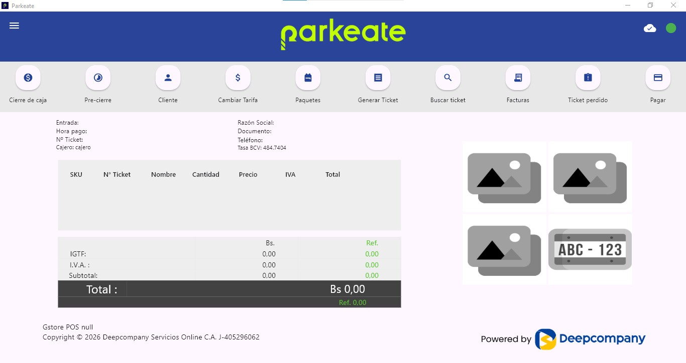

### 1. Barra de Cabecera (Header Bar)

* **Menú Hamburguesa (Izquierda):** Despliega el menú lateral con opciones avanzadas de impresora fiscal y cierres.
* **Logo "parkeate" (Centro):** Marca de identidad visual en verde lima.
* **Indicadores de Conexión (Derecha):**
  * **Ícono de Nube con Check:** Indica el estado de conexión con el Backoffice en la nube.
  * **Círculo Verde/Rojo:** Indica el estado de comunicación con el servidor local (PLS).
  * > [!NOTE]
  * > Estos indicadores sirven como una guía orientativa del estado de red para el operador, pero no son una garantía matemática/absoluta de conectividad o falla, debido a latencias del protocolo.

### 2. Barra de Herramientas y Acciones (Fila Superior)

Contiene 10 botones táctiles de acceso rápido:

* **Cierre de caja:** (Ícono de Moneda $) Inicia el arqueo final del cajero para cerrar el turno y emitir el Reporte Z fiscal. Requiere permiso de un usuario de nivel Supervisor.
* **Pre-cierre:** (Ícono de Reloj) Permite imprimir un reporte de ventas parcial (Reporte X) o de auditoría a mitad de jornada para realizar el cambio de turno. Requiere permiso de un usuario de nivel Supervisor.
* **Cliente:** (Ícono de Usuario) Abre la ventana para buscar, asociar o registrar datos de facturación personalizada del cliente (Razón Social, R.I.F/D.N.I, Teléfono).
* **Cambiar Tarifa:** (Ícono de Signo $) Permite seleccionar tarifas alternativas (ej. tarifa para eventos, convenios especiales, express).
* **Paquetes:** (Ícono de Calendario) Gestiona los abonos para paquetes de Usuarios Frecuentes (SuperApp) y paquetes de tickets de locatarios (App de Comercios).
* **Generar Ticket:** (Ícono de Factura/Recibo) Permite emitir un ticket de entrada de forma manual desde el POS si es necesario. Requiere permiso de un usuario de nivel Supervisor.
* **Buscar ticket:** (Ícono de Lupa) Abre el buscador de tickets en caso de que el código QR del ticket físico esté dañado o ilegible.
* **Facturas:** (Ícono de Recibo) Para buscar facturas emitidas en la caja actual para tickets que aún no han salido. Para casos en que el cliente ya pagó pero perdió la factura.
* **Ticket perdido:** (Ícono de Advertencia / Ticket !) Abre la pantalla para gestionar e ingresar datos por la pérdida del ticket físico.
* **Pagar:** (Ícono de Tarjeta) Abre el resumen de facturación y activa la pasarela/métodos de pago para formalizar el cobro del estacionamiento.

### 3. Panel Informativo (Metadatos del Ticket y Cliente)

Dividido en dos columnas antes de la tabla de cobro:

* **Columna Izquierda (Datos del Ticket Activo):**
  * `Entrada:` Fecha y hora en la que ingresó el vehículo.
  * `Hora pago:` Hora actual en que se calcula el importe, tomada directamente del servidor local (PLS).
  * `Nº Ticket:` Número identificador del ticket escaneado (12 dígitos numéricos: AAMMDD-BB-XXXX, donde AAMMDD es la fecha, BB es la barrera de Entrada y XXXX es el correlativo correspondiente a esa barrera).
  * `Cajero:` Nombre del cajero activo (ej. `cajero`).
* **Columna Central/Derecha (Datos Fiscales y Tasa cambiaria):**
  * `Razón Social:` Nombre de la persona o empresa a facturar.
  * `Documento:` Identificación fiscal (R.I.F. / D.N.I.).
  * `Teléfono:` Teléfono de contacto.
  * `Tasa BCV:` Tasa oficial de cambio de moneda (Ej: `484.7404` Bs/USD, utilizada para calcular las referencias en divisas o la facturación bajo el estándar del Banco Central).

### 4. Rejilla de Facturación (Grid / Detalle de Ítems)

Tabla principal que enumera los conceptos cobrados:

* **SKU / Código:** Identificador del servicio de estacionamiento.
* **Nº Ticket:** Número de ticket asociado al cobro.
* **Nombre:** Descripción del concepto (ej. "Tarifa Plana", "Tarifa por hora", "Ticket Perdido").
* **Cantidad:** Número de unidades/horas a facturar.
* **Precio:** Precio unitario del concepto.
* **IVA:** Impuesto aplicado.
* **Total:** Monto final por renglón.

### 5. Resumen de Impuestos y Total General (Banda de Cierre)

Ubicada en la esquina inferior izquierda:

* **Detalle Multimoneda:** Muestra los valores tanto en moneda local (Bs.) como en la moneda de referencia (Ref. en color verde):
  * **IGTF:** Impuesto a las Grandes Transacciones Financieras aplicable (3% si el cobro se realiza en divisas en efectivo).
  * **I.V.A.:** Total del Impuesto al Valor Agregado acumulado.
  * **Subtotal:** Suma neta antes de impuestos.
* **Banda de Total (Negra):** Destaca el monto total a pagar en bolívares y su equivalente de referencia en dólares.

### 6. Panel de Cámaras y Reconocimiento de Placas (LPR)

Ubicado en la columna derecha para control de seguridad. Este panel puede albergar hasta 4 recuadros dinámicos según el equipamiento del estacionamiento:

* **Recuadros de Captura de Cámara (3 superiores):** Muestra las fotografías del vehículo tomadas en tiempo real por cámaras estratégicas de la barrera de entrada/salida (e.g. cámara frontal, cámara trasera, foto panorámica del auto). Solo se activa si el estacionamiento cuenta con estas cámaras.
* **Recuadro de Placa OCR (Inferior):** Muestra de forma digital la placa leída e interpretada por el sistema LPR (ej. `ABC - 123`). Solo se activa si el estacionamiento cuenta con lector OCR automático.

---

## Pantalla 06: Acceso / Permiso de Supervisor

Esta ventana modal de seguridad bloquea la pantalla cuando el cajero intenta realizar una acción crítica que requiere autorización (por ejemplo, *Cierre de caja*, *Pre-cierre* o *Generar Ticket* manual).

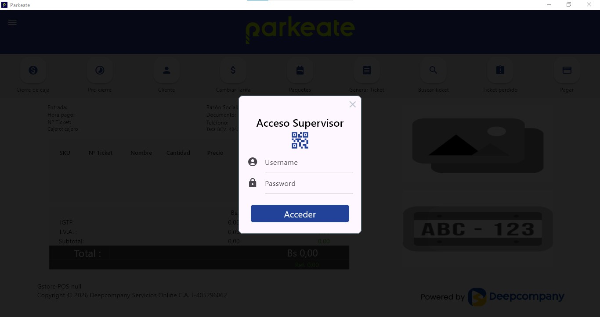

### Métodos de Autorización

* **Escanear Código QR (Recomendado):** El supervisor puede escanear un código QR dinámico desde la App de Supervisor instalada en su teléfono móvil para autorizar la acción al instante sin teclear nada.
* **Ingreso Manual de Credenciales:** El supervisor introduce su nombre de usuario (`Username`) y clave (`Password`) creados previamente en el Backoffice y presiona el botón **Acceder**.

---

## Pantallas 07 y 08: Menú Lateral de la Pantalla Principal

A diferencia del menú lateral de login, este menú se despliega desde la interfaz de cobro principal y contiene herramientas avanzadas de control de caja, opciones fiscales detalladas e integraciones de pago. Es scrollable en dispositivos pequeños.

  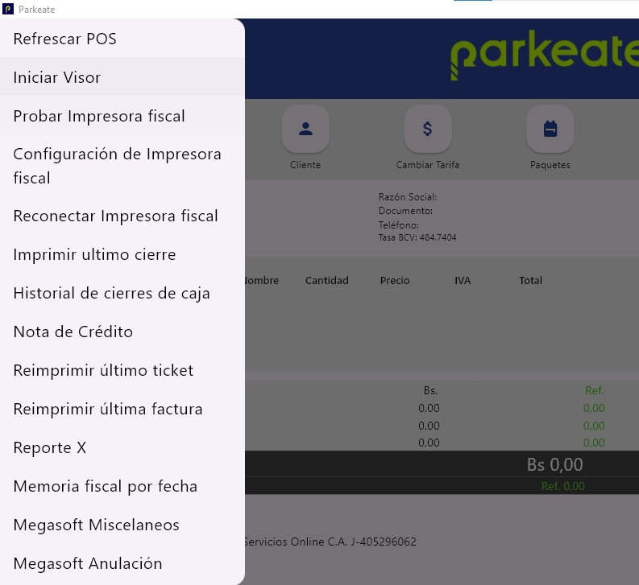
  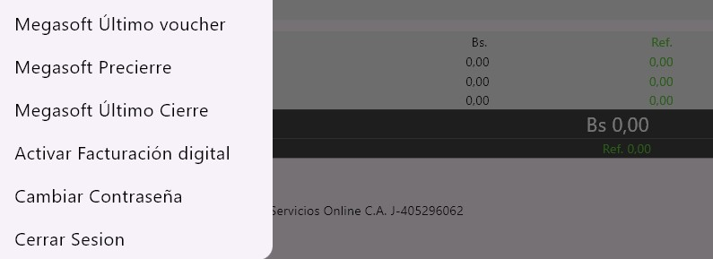
 

### Opciones de Impresora Fiscal y Reportes

* **Probar Impresora fiscal / Reconectar Impresora fiscal:** Pruebas y diagnósticos de impresora fiscal.
* **Configuración de Impresora fiscal:** Muestra la configuración actual de la impresora fiscal, (puertos, velocidad de comunicación, etc.).
* **Imprimir último cierre / Historial de cierres de caja:** Consulta e imprime reportes de cierre de caja.
* **Reimprimir último ticket / Reimprimir última factura:** Copias exactas del ticket último ticket facturado o la última factura emitida (impresión no fiscal).
* **Reporte X:** Emite un reporte X directamente de la impresora, no afecta el turno actual.
* **Memoria fiscal por fecha:** Descarga reportes fiscales directos de la memoria fiscal.

### Integraciones y Opciones de Pago (Pasarela Megasoft)

* **Megasoft Miscelaneos:** Operaciones del servicio de Megasoft. Requiere permiso de Supervisor. Requiere que el servicio de Megasoft esté instalado y ejecutándose en el equipo.
* **Megasoft Anulación:** Permite anular transacciones con tarjetas bancarias directamente desde el POS. La función debe estar activada en la configuración de Megasoft.
* **Megasoft Último voucher:** Reimprime el comprobante del banco (tarjeta de débito/crédito).
* **Megasoft Precierre / Megasoft Último Cierre:** Cierre financiero del punto de venta bancario.

### Opciones Generales

* **Refrescar POS / Iniciar Visor:** Actualiza la interfaz local o arranca la pantalla secundaria de publicidad y precios para el cliente.
* **Nota de Crédito:** Permite emitir notas de crédito. Requiere permiso de Supervisor.
* **Activar Facturación digital:** Alterna entre facturación digital y facturación por impresora fiscal. Solo cuando el estacionamiento cuenta con facturación digital activa.
* **Cambiar Contraseña / Cerrar Sesion:** Gestión básica de perfil de cajero.

---

## Pantalla 09: Buscar Cliente (Facturación Personalizada)

Permite al operador buscar y asociar un perfil fiscal (nombre, RIF, teléfono) a la transacción de cobro actual para emitir facturas con valor tributario personalizado.

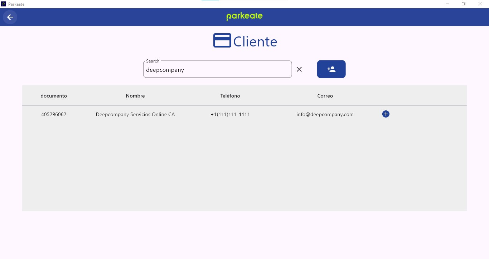

### Flujo de Trabajo

1. **Búsqueda:** Se escribe el documento o nombre del cliente en el campo superior de búsqueda (ej. `deepcompany`).
2. **Selección:** Si el cliente ya existe en el sistema, se presiona el botón azul con el ícono **`+`** al final del renglón para vincularlo al ticket actual. Sus datos se reflejarán automáticamente en el panel de metadatos de la pantalla principal.
3. **Creación:** Si no se encuentra ningún resultado, se presiona el botón azul con el ícono de **Usuario +** (al lado del buscador) para abrir la pantalla de registro de nuevo cliente.

---

## Pantalla 10: Registrar Cliente Nuevo

Pantalla con formulario completo para dar de alta en la base de datos a un cliente eventual que requiere factura personalizada y no estaba registrado previamente.

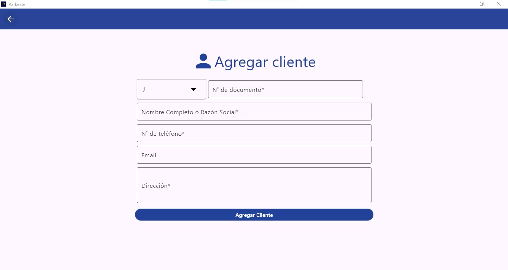

### Campos Requeridos (Marcados con asterisco `*`)

* **Prefijo de Documento:** Menú desplegable para seleccionar el tipo de identificación (ej. `J` para Jurídico/R.I.F., `V` para Cédula Venezolana, `E` para Extranjero, `G` para Gubernamental).
* **N° de documento\***
* **Nombre Completo o Razón Social\***
* **N° de teléfono\***
* **Dirección\*** (Área de texto grande para domicilio fiscal).
* **Email (Opcional):** Para envío automático de factura digital en PDF/XML.

Presionar el botón **Agregar Cliente** para guardar y asociar inmediatamente los datos a la compra.

---

## Pantalla 11: Cambiar Tarifa (Boleto Físico)

Permite redefinir la estructura tarifaria que se le cobrará a un ticket de estacionamiento físico. Las tarifas se administran y activan desde el Backoffice centralizado y el operador del POS solo puede seleccionar las que estén asignadas a la terminal.

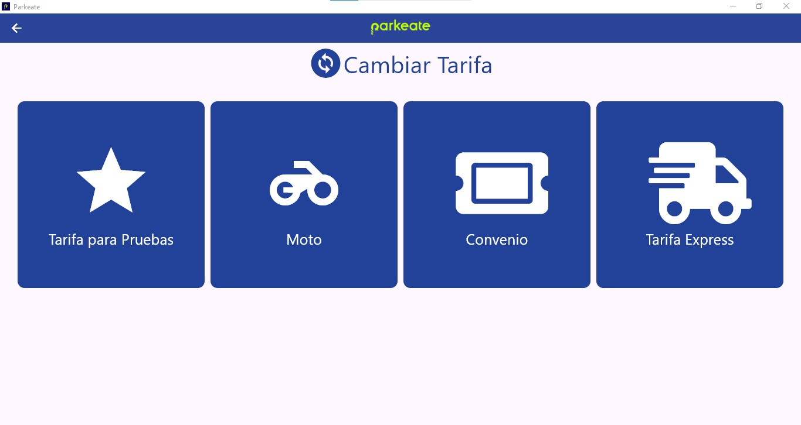

### Tarifas de Ejemplo en Sistema

* **Tarifa para Pruebas (Ícono Estrella):** Utilizada por técnicos para probar la facturación del sistema y la integración con la impresora fiscal.
* **Moto (Ícono Motocicleta):** Aplica la tarifa configurada para vehículos de dos ruedas.
* **Convenio (Ícono Ticket):** Aplicar tarifas especiales.

---

## Pantalla 12: Emisión de Ticket Perdido

Esta interfaz recopila los datos necesarios para facturar la penalidad y dar salida a un vehículo cuando el cliente extravió el boleto físico de entrada.

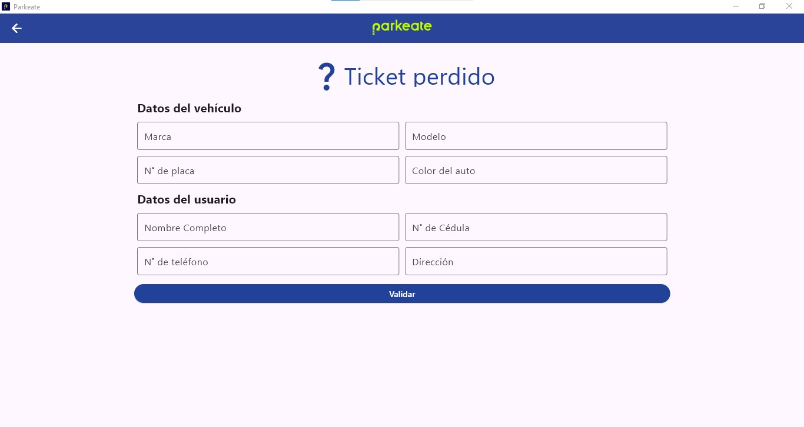

### Flujo de Verificación y Conciliación con LPR

1. **Datos del Vehículo y Usuario:** El operador debe rellenar obligatoriamente la información del automóvil (Marca, Modelo, Placa y Color) y del conductor (Nombre, Cédula, Teléfono y Dirección). Esta información sirve como respaldo legal.
2. **Proceso de Validación:**
   * Al presionar **Validar**, el sistema POS se comunica con el servidor local para verificar si la placa ingresada posee un registro de entrada capturado por las cámaras LPR (License Plate Recognition).
   * **Si la placa coincide:** Se concilia automáticamente el registro de entrada original del vehículo con la factura del ticket perdido al momento de procesar el pago. Ambos registros quedan marcados como cancelados y resueltos, autorizando la salida por barrera.
   * **Si la placa NO coincide (Sin cámara o error de lectura):** El ticket perdido se cobra de manera genérica para permitir la salida del vehículo, pero el registro original en la base de datos de entrada quedará pendiente en estado "no pagado" para su auditoría manual posterior.

---

## Pantallas 13 y 14: Buscar y Verificar Paquetes (Usuarios Frecuentes y Locatarios)

Esta interfaz permite buscar paquetes especiales de estacionamiento asociados a un cliente específico (ya sea por nombre, correo o RIF/Cédula) para realizar cobros pre-pagados o pos-pagados, o validar abonos de usuarios frecuentes.

  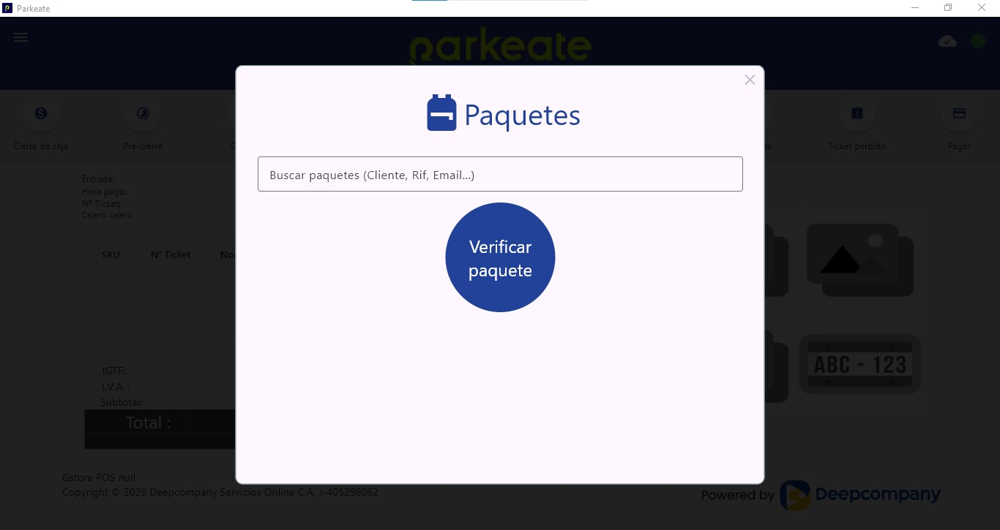
  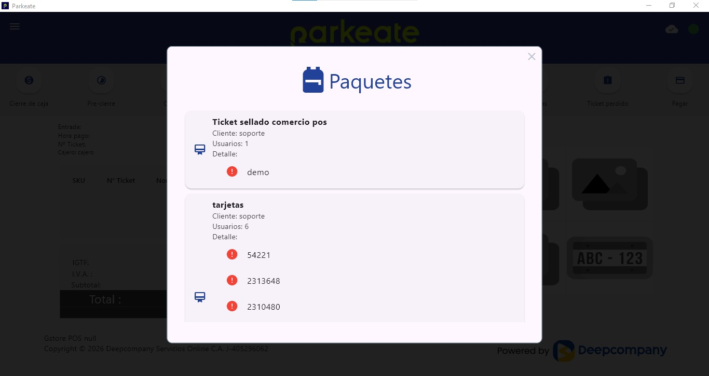

### Funcionamiento y Tipos de Paquete

Al ingresar el cliente y presionar **Verificar paquete**, el sistema despliega todas las suscripciones activas del cliente y su desglose de usuarios/tickets:

1. **Paquetes de Usuarios Frecuentes (SuperApp):** Se calcula multiplicando la cantidad de usuarios activos en el paquete por el precio unitario del abono.
2. **Paquetes de Tickets Sellados (Cobro Prepago):** Corresponde a abonos adquiridos con anticipación por comercios. Se factura a razón de 1 paquete por el precio unitario del convenio.
3. **Paquetes de Tickets Sellados (Cobro Pospago):** Utilizado por locatarios cuyos clientes sellan tickets para descuento. El sistema lleva la cuenta y factura al final del período calculando la *cantidad de tickets usados* multiplicada por el *precio unitario* pactado.

> [!TIP]
> **Indicador de Estado:** La presencia del ícono indicador rojo **`(!)`** al lado del usuario o ticket indica que dicho ítem se encuentra elegible y pendiente por ser facturado/cobrado en el POS.

---

## Pantalla 15: Generar Ticket de Caja

Permite emitir manualmente un ticket físico de entrada al estacionamiento directamente desde el POS. Esta acción es restrictiva y requiere autorización de nivel Supervisor.

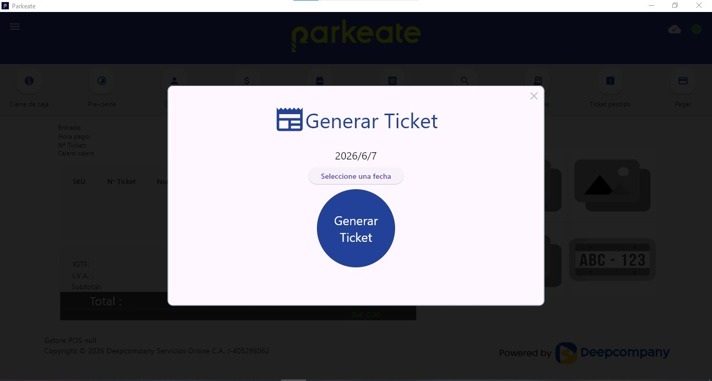

### Casos de Uso Comunes

* **Falla de Emisor en Entrada:** Si la máquina tiquetera del carril de entrada sufre un atasco de papel o falla de red, el supervisor puede autorizar la entrega de un ticket manual en la entrada.
* **Proveedores y Contratistas:** Para registrar vehículos que ingresan temporalmente a descargar mercancía y cuyo control se formaliza o "convierte" en un ticket de estacionamiento regular al llegar a la taquilla de cobro.
* **Selección de Fecha:** Permite ajustar la fecha/hora de entrada del ticket si se requiere una auditoría o un cobro retroactivo específico.

---

## Pantallas 16 y 17: Buscar Ticket (Ingreso Manual)

Módulo alternativo de cobro diseñado para cuando el escáner de códigos de barra o código QR de la caja no logra leer el boleto físico (por estar arrugado, manchado o mal impreso).

  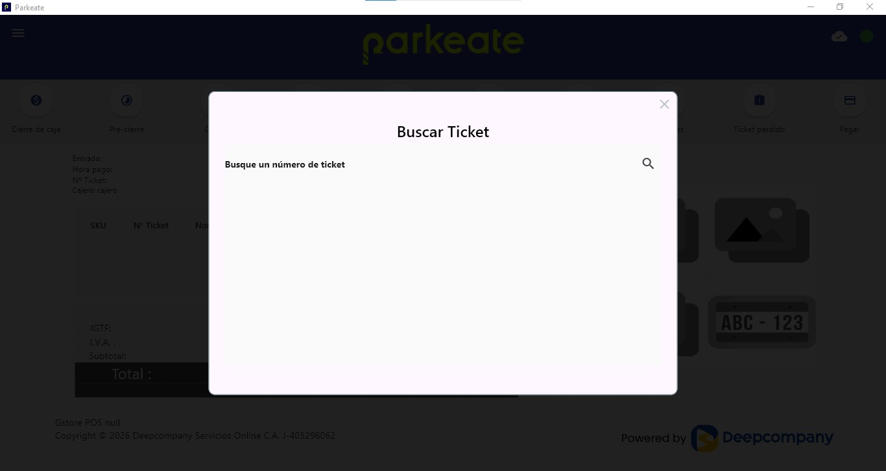
  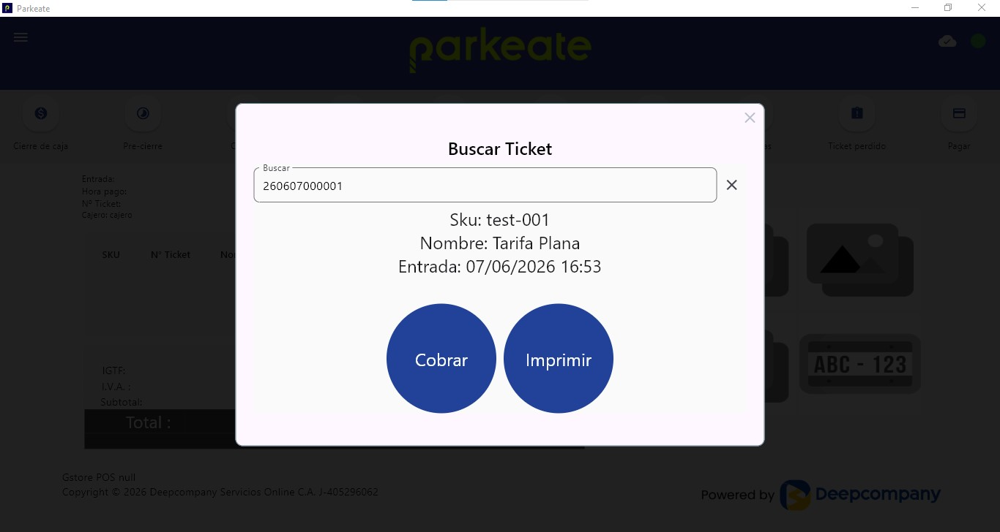

### Flujo de Operación

1. **Búsqueda:** El operador digita manualmente el número correlativo impreso debajo del código del ticket (ej. `260607000001`) y presiona buscar.
2. **Visualización de Resultados:** El modal recupera del servidor local los datos del boleto:
   * Código de SKU asociado.
   * Nombre de la tarifa activa (ej. "Tarifa Plana").
   * Fecha y hora exacta de entrada (`Entrada: 07/06/2026 16:53`).
3. **Acciones Disponibles:**
   * **Cobrar (Botón Azul):** Carga inmediatamente el boleto a la rejilla de facturación de la pantalla principal, equivalente a haber escaneado el QR con éxito.
   * **Imprimir (Botón Azul):** Envía una orden de reimpresión de la entrada a la impresora de recibos, útil en caso de que el cliente requiera un boleto legible para su resguardo.

---

## Pantallas 18 y 19: Buscar Facturas (Reimpresión y Consulta)

Este panel permite auditar, consultar y reimprimir facturas que ya han sido cobradas en la caja actual, pero cuyos vehículos aún no han salido físicamente del estacionamiento.

  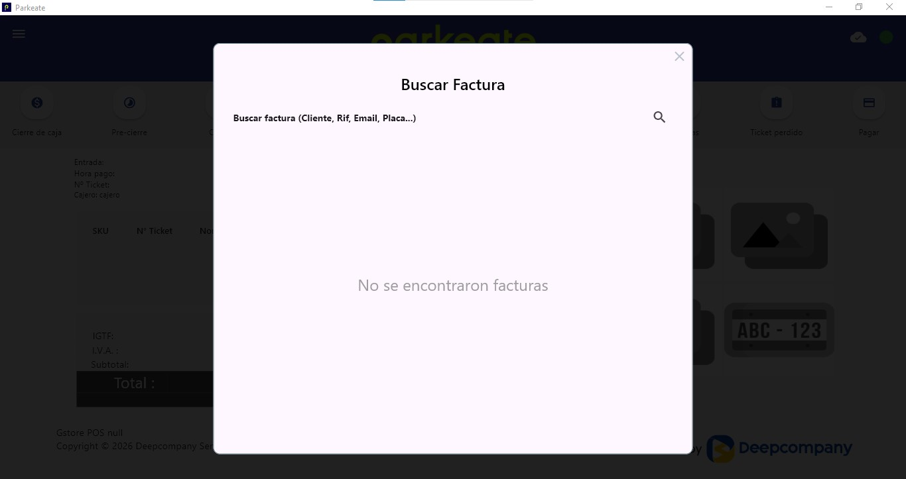
  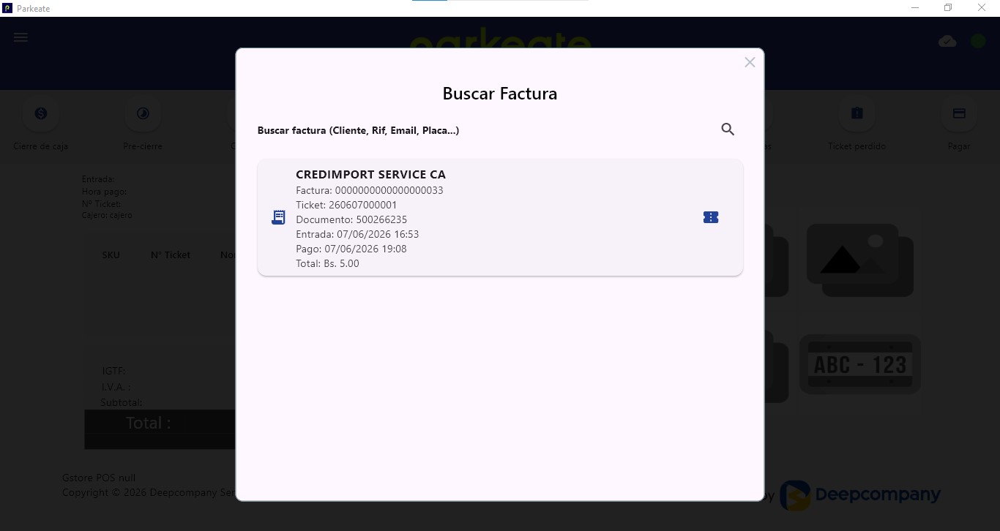

### Características del Buscador

* **Campos de Búsqueda Soportados:** Búsqueda abierta por número de ticket, número de factura fiscal, número de cédula/RIF del cliente, nombre completo, correo electrónico o placa del vehículo.
* **Información Detallada de la Factura:** Al encontrar coincidencia (ej. *CREDIMPORT SERVICE CA*), muestra:
  * Razón Social y Cédula/RIF.
  * Número de factura correlativo fiscal.
  * Número de ticket de estacionamiento.
  * Fecha/hora de entrada y fecha/hora exacta del pago.
  * Monto total facturado en bolívares.
* **Acciones en la Ficha:**
  * **Ícono de Impresora (Izquierda):** Permite reimprimir la factura fiscal o el recibo.
  * **Ícono de Ticket (Derecha):** Permite reimprimir el ticket de salida (código de barras habilitado para abrir la barrera). Si el sistema posee cámaras LPR asociadas, este botón también despliega una vista previa de las fotografías capturadas como respaldo de seguridad.

---

## Pantallas 20 a 23: Registro de Pago y Facturación Multimétodo

Esta es la pasarela de facturación final, donde el operador procesa el pago del total calculado y cierra la transacción fiscalmente. Es una pantalla altamente dinámica con controles de seguridad automatizados.

  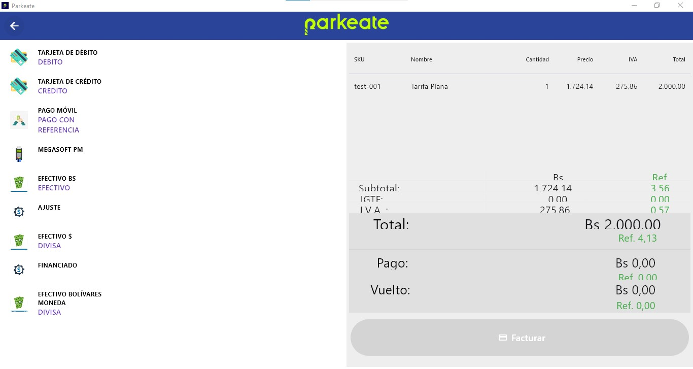
  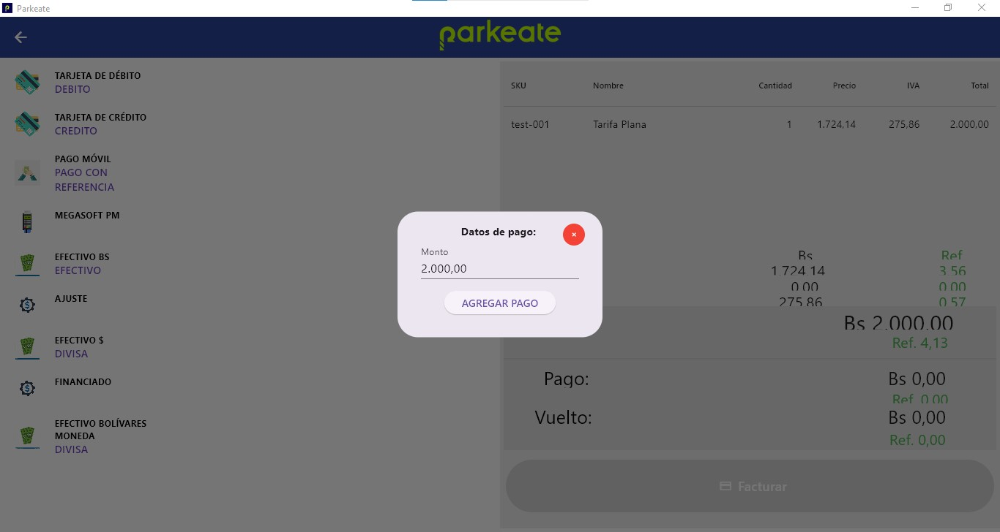

  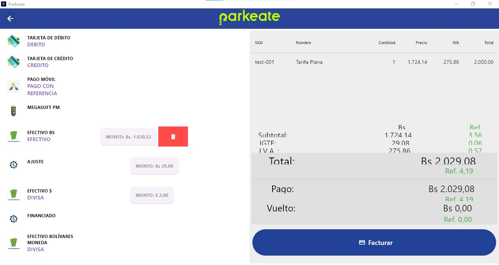
  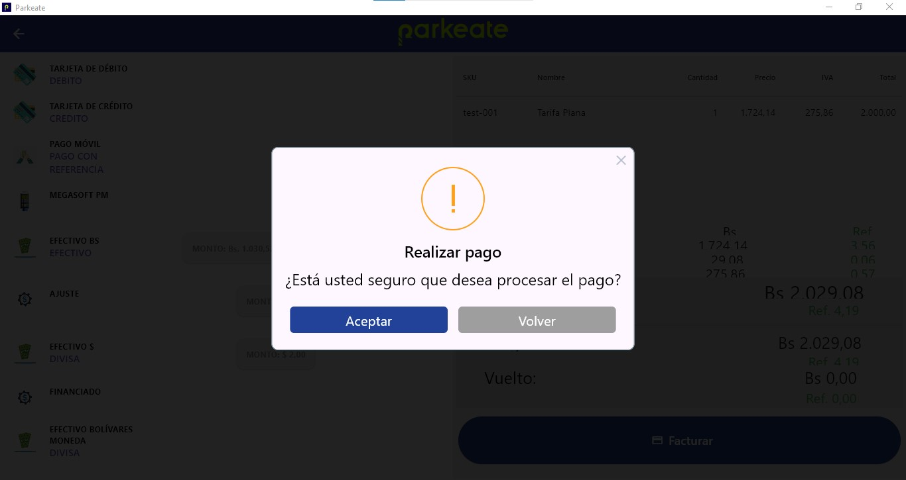

### Reglas del Flujo de Pago

1. **Bloqueo de Facturación:** El botón **Facturar** en la parte inferior derecha permanece bloqueado (gris) y no puede presionarse hasta que el monto acumulado en la lista de pagos sea estrictamente igual o mayor al total de la factura.
2. **Ingreso Automático de Montos:** Al hacer clic sobre cualquier método de pago en la columna izquierda (Débito, Crédito, Efectivo, Pago Móvil, etc.), se abre un modal con el campo "Monto" pre-rellenado automáticamente con la diferencia restante para completar la cuenta. El operador solo debe presionar **Agregar Pago** o ajustar la cifra si es un pago dividido.
3. **Conversión Cambiaria Automática:** Si se selecciona un método de pago en moneda extranjera (ej. `EFECTIVO $`), el sistema convierte automáticamente el monto a bolívares usando la tasa BCV activa del día y calcula el IGTF (Impuesto a Grandes Transacciones Financieras) correspondiente al pago en divisas en efectivo.
4. **Cálculo de Impuestos y Recargos (Caso IGTF):**
   * En la imagen de ejemplo, se agregan $ 2,00 USD en efectivo. Esto genera automáticamente un impuesto IGTF del 3% (equivalente a `Bs. 29,08` / `Ref 0,06`), el cual se suma en tiempo real al total de la factura (que pasa de `Bs. 2.000,00` a `Bs. 2.029,08`).
   * **Ajuste Automatizado:** El método de pago **`AJUSTE`** es una funcionalidad específica para el cliente corporativo **"Promotora Tántalo"**, la cual registra y balancea automáticamente la cuenta con el cargo de IGTF generado al pagar en divisas.
5. **Edición y Eliminación Dinámica:**
   * **Editar:** Al hacer clic sobre un chip de pago ya agregado en la columna central, se abre el modal para modificar su monto.
   * **Eliminar:** El operador puede hacer clic y arrastrar el chip de pago lateralmente con el mouse (o deslizar en pantallas táctiles) para revelar el ícono rojo de papelera y eliminar el pago agregado, recalculando la diferencia al instante.
6. **Confirmación Final:** Al completarse el pago, el botón **Facturar** se activa. Al hacer clic, se muestra un popup de advertencia (*¿Está usted seguro que desea procesar el pago?*). Al pulsar **Aceptar**, la impresora fiscal emite la factura, se actualiza el estatus del ticket y se envía la orden de apertura de la barrera de salida.

---

## Pantalla 24: Nota de Crédito (Anulaciones)

Módulo administrativo y fiscal diseñado para anular facturas mal emitidas o reembolsar cobros erróneos de estacionamiento. Esta acción requiere obligatoriamente autorización de nivel Supervisor.

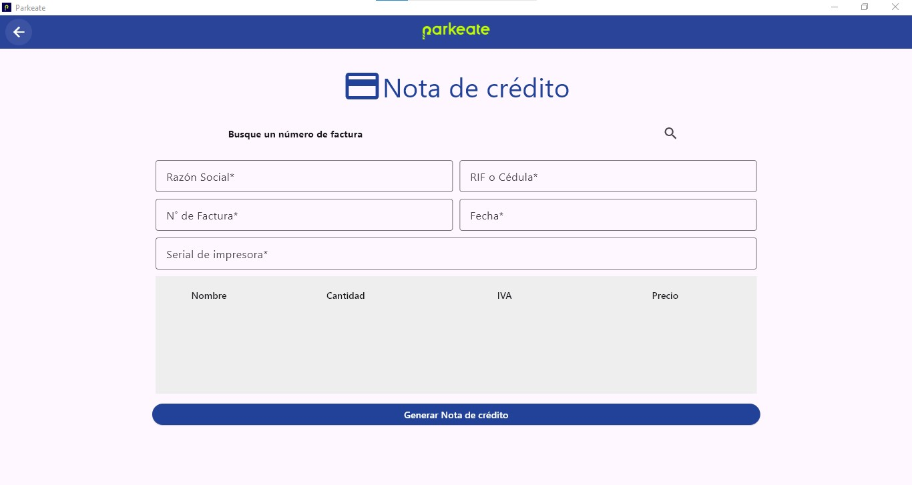

### Reglas y Procesamiento

* **Búsqueda por Factura:** El operador debe ingresar el número de factura fiscal afectada en el buscador superior. El sistema realiza la consulta y recupera los metadatos correspondientes directamente desde la memoria fiscal local/nube.
* **Llenado Automático de Datos:** Al encontrar la factura, se rellenan de forma segura e inalterable los campos de:
  * Razón Social y RIF o Cédula del cliente afectado.
  * Número de factura y fecha de emisión.
  * Serial único de la impresora fiscal que emitió el cobro original.
* **Detalle del Contenido:** La tabla inferior despliega los ítems originales de la factura.
* **Anulación Total:** De acuerdo a la normativa fiscal y a la lógica de la aplicación, las notas de crédito se emiten siempre por el **monto total** de la factura afectada, restableciendo el estatus del ticket de estacionamiento en el sistema de ser necesario.
* **Generación:** Al presionar **Generar Nota de crédito**, la impresora fiscal emite el documento de anulación correspondiente para el archivo contable de la taquilla.

---

## Pantallas 25 y 26: Pre-cierre de Caja (Corte y Cambio de Turno)

El Pre-cierre permite auditar el estado financiero de la caja a mitad de jornada o gestionar la entrega de turno al siguiente operador. Requiere obligatoriamente autorización de nivel Supervisor.

  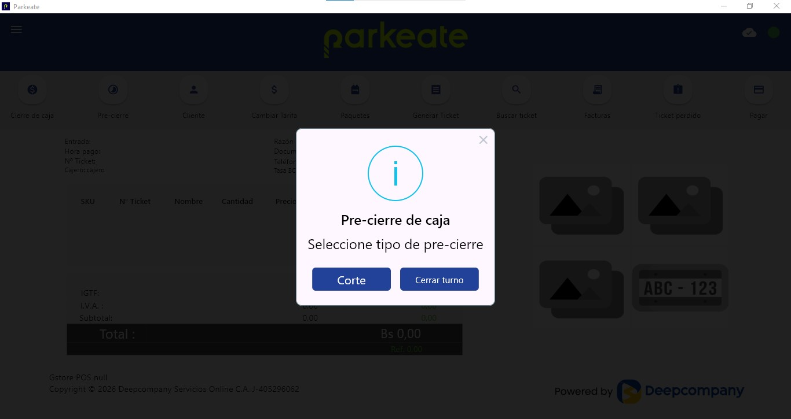
  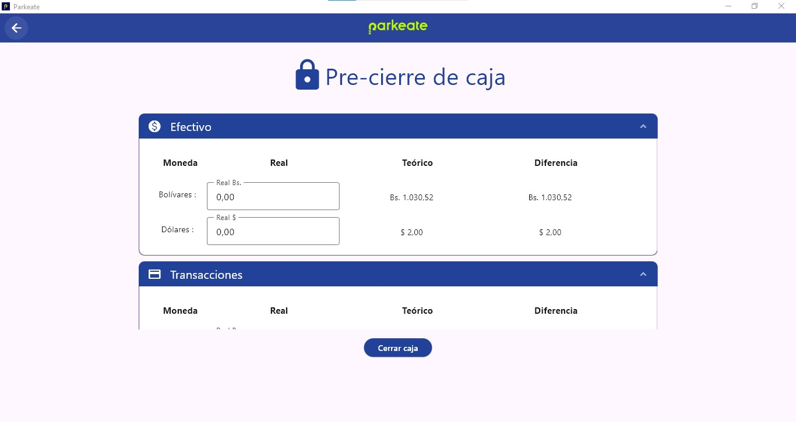

### Flujo de Opciones y Arqueo

1. **Selección del Tipo:** Al activar *Pre-cierre*, se presenta un diálogo con dos alternativas:
   * **Corte (Botón Azul):** Genera un reporte parcial de ventas del cajero actual para auditoría interna, **sin cerrar** el turno ni desloguear al usuario.
   * **Cerrar turno (Botón Azul):** Finaliza formalmente el turno del cajero actual, emitiendo el reporte correspondiente y cerrando de forma automática su sesión para permitir el login del siguiente operador.
2. **Formulario de Arqueo de Caja:**
   * **Sección Efectivo:** Muestra las monedas de curso legal (Bolívares y Dólares). El supervisor u operador debe rellenar físicamente la columna `Real` (monto contado físicamente en caja). El sistema muestra la columna `Teórico` (lo que debería haber según las ventas del sistema) y calcula la `Diferencia` automáticamente.
   * **Sección Transacciones:** Muestra el desglose teórico de pagos electrónicos (débito, crédito, pago móvil) para ser confrontados con los reportes impresos de los puntos de venta bancarios (vouchers).
3. **Guardar:** Se pulsa el botón **Cerrar caja** para almacenar la auditoría del arqueo y emitir el reporte X correspondiente por la impresora fiscal.

---

## Pantalla 27: Cierre de Caja (Cierre de Caja y Reporte Z)

El Cierre de Caja es el proceso contable final que se realiza al terminar el día operativo del estacionamiento. Requiere obligatoriamente la autorización de nivel Supervisor.

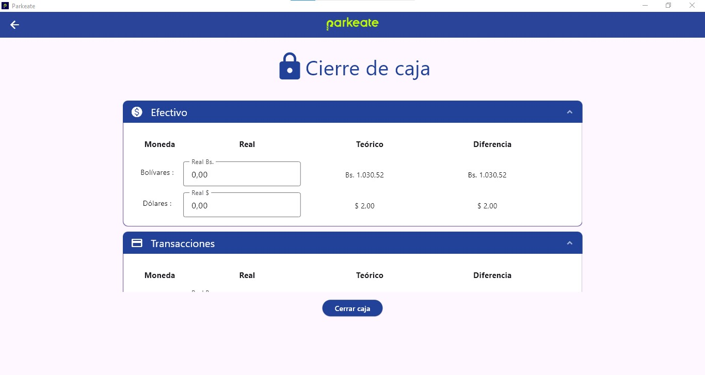

### Reglas y Emisión del Reporte Z Fiscal

* **Arqueo de Caja Obligatorio:** Al igual que en el pre-cierre, se despliega el formulario de balanceo físico de caja (columna `Real` de efectivo en bolívares/dólares, y validación de vouchers de transacciones electrónicas).
* **Cerrar Caja (Reporte Z):** Al validar los montos y presionar **Cerrar caja**, el sistema POS ejecuta las siguientes acciones definitivas:
  1. Envía la orden a la impresora fiscal conectada para emitir el **Reporte Z** (cierre diario fiscal). Este proceso borra la memoria de trabajo diaria de la impresora y la graba de forma permanente en su memoria fiscal.
  2. Finaliza y cierra de forma absoluta el día contable en la base de datos de la terminal local y sincroniza los resultados con el Backoffice en la nube.
  3. Cierra la sesión activa de la aplicación y la bloquea en la pantalla de Login para el siguiente día laboral.

---

## Próximos Pasos en el Manual

Una vez completada y aprobada la documentación del resto de flujos operativos en este Markdown:

1. **Creación de index.html:** Procederemos a diseñar y maquetar la Web App interactiva de manual de usuario en un solo archivo auto-contenido.
2. **Navegación e Interacción:** Implementaremos un sidebar lateral responsivo con menús desplegables para saltar cómodamente entre las 27 pantallas.
3. **Visor de Imágenes y Hotspots:** Habilitaremos el Lightbox de zoom de capturas y un panel interactivo de **Hotspots** (pines interactivos sobre la captura de la pantalla principal) para detallar cada sección del POS de forma visual.
